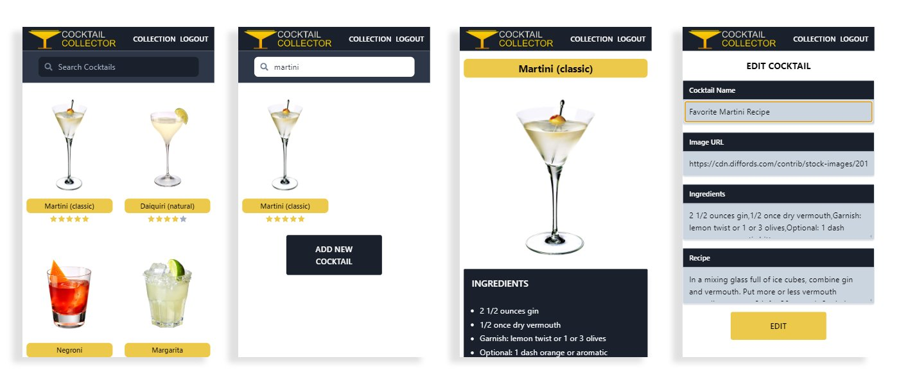
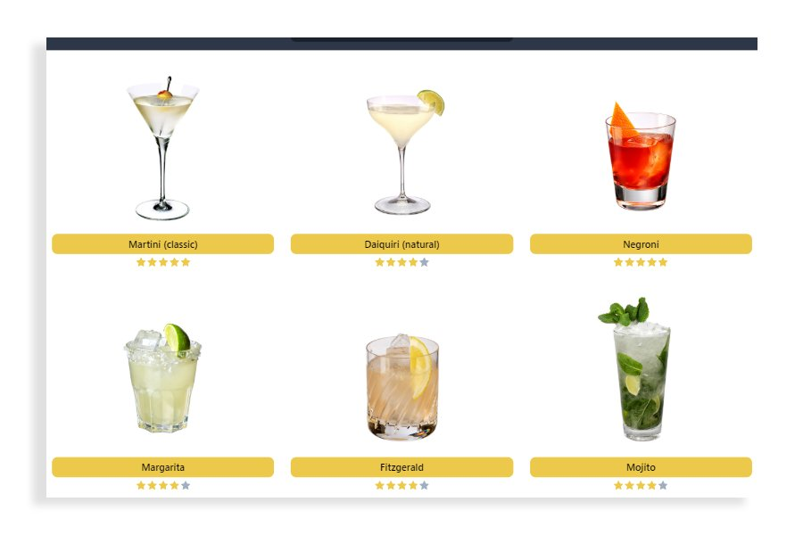

# Cocktail Collector

A fast and minimalistic Cocktail recipe sharing app made with React and TailwindCSS.

    

Users can create new cocktails, edit and delete them, and also browse their collections with the help of a search bar.

The design was thought out to be mobile first and fully responsive:

    

### Technologies Used

* React
* TailwindCSS
* Axios (with useAxios hook)

